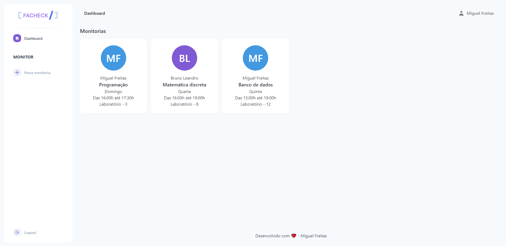
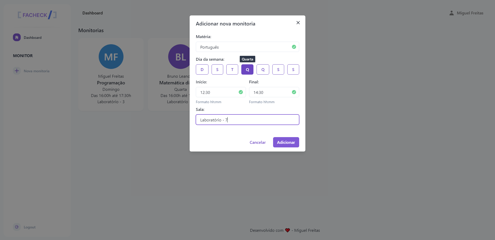

  

## Facheck

<h4>
  Facheck is a plataform to help students from FATEC find help with other students (known as monitors) in subjects they have difficulties.
</h4>

## Layout

Signup:

Login:

Monitorings:

Add monitoring:

---

<h4 align="center">Made with ❤ - Miguel F.</h4>